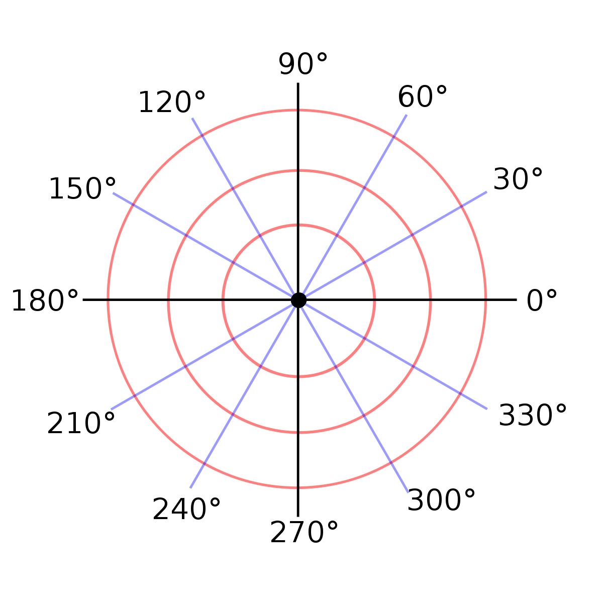

ГЛАВА: JS: АБСТРАКЦИЯ С ПОМОЩЬЮ ДАННЫХ ============================

Теория: Введение ========================

Абстракция – основной способ борьбы со сложностью в программировании. Она позволяет уйти от деталей реализации и сосредоточиться на главном.

Хороший пример абстракции – функция сортировки массива. Не важно как она устроена, важно что она приводит к результату, который нас интересует.

Другой пример – функции высшего порядка, такие как map, filter и reduce, которые позволяют обрабатывать коллекции без знания их внутреннего устройства. Причём коллекции не обязательно должны быть плоскими, подобные функции можно написать для сколь угодно сложных структур, например, для деревьев. И благодаря такой абстракции мы можем сосредоточиться на самой обработке, а не на процессе обхода данных.

С другой стороны, сами данные нередко имеют сложную структуру. Представление пользователя в нетривиальной системе может потребовать описания десятков и сотен различных параметров и данных, связанных с ними. В такой ситуации полезно спрятать эту структуру за набором функций, что скроет внутреннюю сложность и упростит поддержку кода. Это называется абстракцией с помощью данных.

В этом курсе мы познакомимся с некоторыми базовыми принципами проектирования программ. С тем, как моделировать и представлять в программе объекты реального (и воображаемого) мира. Примером проектирования послужит создание библиотеки для работы с графическими примитивами, такими как точки, отрезки, фигуры. Эта библиотека, с одной стороны, достаточно понятна для всех (в том числе визуально), с другой — очень просто представляется в коде.

Основные темы курса:

Предметная область (Domain Model)
Онтология
Уровни проектирования (Барьеры абстракции)
Инварианты

ТЕОРИЯ: ОНТОЛОГИЯ =============================

Рассмотрим в качестве примера Хекслет, так как вы с ним достаточно хорошо знакомы. Вы неплохо знаете его предметную область, хотя вряд ли думали о ней так, как мы сделаем это сейчас. В первую очередь, для её понимания нужно выделить ключевые понятия. У обучающих ресурсов это, как правило, "курс" и "урок", но на самом деле их гораздо больше. В случае Хекслета ещё можно выделить профессию, челендж (практика после курса), code review, квиз (набор вопросов и ответов), участника курса (вы становитесь участником, когда вступаете в курс), проект. Этот список можно продолжать ещё долго. Вероятно, вы удивитесь, но на Хекслете более 200 подобных понятий, которые также называют сущностями, и все они описаны в коде.

Сущности находятся в некоторых взаимоотношениях друг с другом. Например, квиз содержит (агрегирует) в себе вопросы. А каждый вопрос, в свою очередь, содержит в себе ответы. Профессия состоит из курсов, а курсы — из уроков, уроки — из теории, квиза и практики. Эти связи имеют конкретные названия. Например:

Один урок может находиться только в одном курсе, но курс содержит множество уроков. Такая связь называется "один ко многим" (one-to-many или o2m).
Один курс могут проходить множество пользователей, и один пользователь может проходить много курсов. Такая связь уже называется "многие ко многим" (many-to-many или m2m).
Реже встречается отношение "один к одному" (one-to-one или o2o). На Хекслете так связаны урок и упражнение.

В реальности всё ещё чуть сложнее, потому что одна и та же сущность с точки зрения разных систем может выглядеть совершенно по-разному. Пользователь Хекслета с точки зрения бухгалтера (а у нас есть бухгалтер!) и с точки зрения поддержки — две большие разницы.

Описание объектов рассматриваемой области и связей между ними называется онтологией предметной области. Эту онтологию хорошо знают эксперты соответствующей области (в бухгалтерии — бухгалтер, в обучении — преподаватель). Но, в отличие от программистов, они часто представляют её на интуитивном уровне, неформально. На практике программисты (или бизнес-аналитики и менеджеры) общаются с заказчиками, которые могут сами выступать в роли экспертов и строят вместе с ними формальную онтологию (это происходит постоянно в процессе развития проекта и не выделяется в отдельный этап проектирования). То есть выделяют конкретные термины, договариваются о том, что они означают и как связаны друг с другом. Затем с помощью ER-модели программист формирует необходимую модель данных. ER-модель используется при высокоуровневом (концептуальном) проектировании баз данных. На этом этапе уже проявляются зачатки архитектуры будущего приложения.

Далеко не всегда можно однозначно сказать, какая связь существует между двумя сущностями. Иногда программисты думают наперёд и сразу формируют более сложные связи, например, m2m, а не o2m, что сказывается на сложности кода. Чем сложнее связь, тем больше кода и выше стоимость его создания и поддержки. Сложность связей можно описать так (правее — сложнее): o2o, o2m, m2m. Иногда программисты ошибаются при выборе той или иной связи, что обычно говорит о недостаточно хорошем понимании предметной области. Приведу интересный пример. Предположим, что в системе нужно реализовать пользователя и заграничный паспорт. Интуитивно кажется что между этими понятиями связь один к одному: ведь один пользователь может иметь один заграничный паспорт. Так? Не совсем: паспорт может поменяться, если он был утерян или закончился его срок действия. К тому же, в некоторых странах разрешено владение одновременно несколькими заграничными паспортами.

С другой стороны, реальный мир всегда сложнее и полнее, чем любая модель. И задача программиста состоит не в том, чтобы создать универсальную и всеобъемлющую модель некоторой области, а в том, чтобы понять потребности конкретного бизнеса, выделить для них только значимые части рассматриваемой предметной области и перенести их в код.

В зависимости от языка меняется способ представления сущностей в коде. В некоторых определяются типы (используя АТД, интерфейсы или классы), в других — структуры, а третьи вообще не предоставляют никаких вариантов, кроме словарей (ассоциативных массивов).

Объектно-ориентированное программирование (ООП) имеет непосредственное отношение к рассматриваемой теме. Со следующего урока мы начнём изучать различные предметные области и строить подходящие модели данных, попутно изучая новые возможности JavaScript.

Наиболее полно рассматриваемая тема раскроется тогда, когда мы начнём изучать ORM. Сейчас достаточно того, что у вас есть общее представление о предметной области, сущностях и связях. Не забудьте почитать информацию по приведённым ссылкам — чем больше вопросов появится на этом этапе, тем лучше.

ДОПОЛНИТЕЛЬНЫЕ МАТЕРИАЛЫ

Онтология - https://ru.wikipedia.org/wiki/Онтология

Предметно-ориентированное проектирование - https://ru.wikipedia.org/wiki/Предметно-ориентированное_проектирование

ER-модель - https://ru.wikipedia.org/wiki/ER-модель

ТЕОРИЯ: ТОЧКИ НА КООРДИНАТНОЙ ПЛОСКОСТИ =============================================

Одна из самых удобных тем для тренировки навыков моделирования — геометрия. В отличие от других разделов математики, она визуально представима и интуитивно понятна для всех. Для начала вспомним базовые понятия, с которыми будем иметь дело.

Координатная плоскость (декартова) — плоскость, на которой задана система координат. Координаты задаются на двух пересекающихся под прямым углом прямых (числовых осях) x и y.

```
y |
6 │
5 │
4 │
3 │    ● (2, 3)
2 │
1 │
──┼───────────────────
  │ 1 2 3 4 5 6      x
  │
  │

```

Самый простой примитив, который можно расположить на плоскости — точка. Её положение определяется двумя координатами, и в математике она записывается так: (2, 3), где первое число — координата по оси x, а второе — по оси y. В коде её можно представить как массив, состоящий из двух элементов.

```js
const point = [2, 3]
```

Этого уже достаточно для выполнения полезных геометрических действий. Например, для поиска симметричной точки относительно оси x, достаточно инвертировать (поменять знак на противоположный) второе число.

```js
const point = [2, 3]

const [x, y] = point
// x = 2, y = 3

const symmetricalPoint = [x, -y]
// x = 2, y = -3
```

Иногда бывает нужно найти точку, находящуюся между двумя другими точками ровно посередине (ещё говорят, что нужно найти середину отрезка). Такая точка вычисляется через поиск среднего арифметического каждой из координат. То есть координата x "срединной" точки равна (x1 + x2) / 2, а координата y — (y1 + y2) / 2.

```js
const getMiddlePoint = (p1, p2) => {
  const x = (p1[0] + p2[0]) / 2
  const y = (p1[1] + p2[1]) / 2

  return [x, y]
}

const point1 = [2, 3]
const point2 = [-4, 0]

console.log(getMiddlePoint(point1, point2)) // => [-1, 1.5]
```

Подобных операций в геометрии очень много. С точки зрения организации кода, все функции, связанные с работой точек, логично поместить в модуль points.

В свою очередь, точки объединяются в отрезки. Каждый отрезок задаётся парой точек, одна из которых — начало, другая — конец отрезка. Отрезок в коде можно представить аналогично точке — массивом из двух элементов, в котором каждый элемент — точка.

```js
const point1 = [3, 4]
const point2 = [-8, 10]
const segment = [point1, point2]
```

Испытание-1: точки на координатной плоскости +1 |

Реализуйте и экспортируйте по умолчанию функцию, которая находит расстояние между двумя точками на плоскости:

```js
point1 = [0, 0]
point2 = [3, 4]
calculateDistance(point1, point2) // 5
```

Подсказки
Формула расчета расстояния между двумя точками: Math.sqrt(((x2 - x1) ** 2) + ((y2 - y1) ** 2)), где x1, y1 — это координаты первой точки, а x2, y2 — координаты второй

<details>
  <summary>Посмотреть решение</summary>

```js
// my solution
const calculateDistance = (point1, point2) => {
  const [x1, y1] = point1
  const [x2, y2] = point2
  const result = Math.sqrt((x2 - x1) ** 2 + (y2 - y1) ** 2)

  return result
}

// teacher solution
const calculateDistance = (point1, point2) => {
  const deltaX = point2[0] - point1[0]
  const deltaY = point2[1] - point1[1]

  return Math.sqrt(deltaX ** 2 + deltaY ** 2)

  // Альтернативный вариант с использованием Math.hypot
  // https://developer.mozilla.org/ru/docs/Web/JavaScript/Reference/Global_Objects/Math/hypot
  // return Math.hypot(deltaX, deltaY);
}

// solution 3
const calculateDistance = ([x1, y1], [x2, y2]) => {
  return Math.sqrt((x2 - x1) ** 2 + (y2 - y1) ** 2)
}
```

</details>

ТЕОРИЯ: СЕМАНТИКА МАССИВОВ ==================================

В предыдущем уроке сказано, что массив — самый простой способ представить точку. Но правильный ли это способ? Давайте разберёмся.

Когда мы говорим про конструкции языка, то, помимо синтаксиса, нужно всегда помнить о семантике. То есть о том, для решения каких задач используются конструкции языка. На практике же инструменты часто используются не по назначению. Это приводит к созданию кода, который сложнее понять и отлаживать, а значит и поддерживать.

Массив (индексированный), по своей сути, — коллекция, набор некоторых однотипных значений, подразумевающих возможность перебора и одинаковой обработки. Кроме того, эти значения друг с другом жёстко не связаны и могут существовать независимо. В массиве часто (но не всегда) отсутствует позиционность, то есть жёстко зафиксированные места для его значений. Либо позиция зависит от конкретной задачи. Вот некоторые примеры из жизни, где массивы подходят:

Список стоп-слов
Список пользователей
Список уроков курса
Список ходов шахматной партии (порядок важен)
Применительно к нашей графической библиотеке массив подходит, например, для хранения коллекции точек или набора отрезков.

Сама точка не является коллекцией. Это единое целое, части которого не имеют смысла сами по себе. Между ними нельзя установить никакого порядка, в отличие от, скажем, списка пользователей. А код работающий с конкретной точкой, представленной массивом, всегда ожидает, что массив состоит из двух элементов, каждый из которых имеет определённую позицию. Другими словами, массив используется как структура для описания составного объекта (то есть такого, который описывается не одним значением, а несколькими, в данном случае — двумя числами-координатами).

В такой ситуации правильнее использовать объект:

```js
const point = { x: 2, y: 3 }
const symmetricalPoint = { x: -point.x, y: point.y }
```

Кода стало чуть больше, но семантика важнее. Такой код проще понимать, потому что вместо странных point[0] или point[1] появляются совершенно понятные с первого взгляда конструкции: point.x. Даже при выводе на экран сразу понятно, о чём идёт речь.

Представьте, как будет выглядеть представление отрезка на массивах. Как массив массивов:

```js
const point1 = [2, 3]
const point2 = [-8, 10]
const segment = [point1, point2]

// код сложный для понимания
point1[1]
point2[0]
segment[1][0]
```

Понять, что это отрезок, нереально без понимания контекста. Единственное, что частично спасает ситуацию — хорошие имена переменных, но этого мало.

Использование правильной (подходящей под задачу) структуры данных намного важнее:

```js
const point1 = { x: 3, y: 4 }
const point2 = { x: -8, y: 10 }
const segment = { beginPoint: point1, endPoint: point2 }

// такой код уже проще для понимания
point1.x
point2.y
segment.endPoint.y
```

Запомните простое правило: код, который заставляет думать — неговорящие имена, плохие абстракции, неправильные структуры данных, сильная зависимость от контекста — плохой код (при этом важно не путать лёгкость и простоту).

Использование объекта сразу даёт ещё одно крайне важное преимущество — расширяемость. Индексированный массив, используемый как структура, хрупок. Поменять местами значение аргументов нельзя — сломается весь код, который рассчитывал на определённый порядок, либо придётся всё переписывать. Расширить тоже просто так не получится: часть кода, конечно, продолжит работать, но часть может сломаться (например, [x, y] = point). А использование объекта не полагается на порядок ключей и уж точно не зависит от их количества. В любой момент можно добавить новый ключ, и программа почти наверняка останется работоспособной.

Какие ещё данные нужно представлять в виде объектов? Любую одиночную сущность:

• Пользователь  
• Курс  
• Урок  
• Платёж  
• Шахматная партия (помимо даты, имён и места, она содержит набор ходов)

Испытание-2: СЕМАНТИКА МАССИВОВ

Реализуйте и экспортируйте по умолчанию функцию, которая находит точку посередине между двумя указанными точками.

Примеры

```js
const point1 = { x: 0, y: 0 }
const point2 = { x: 4, y: 4 }
const point3 = getMidpoint(point1, point2)
console.log(point3) // => { x: 2, y: 2 };
```

Подсказки
Средняя точка вычисляется по формуле x = (x1 + x2) / 2 и y = (y1 + y2) / 2.

<details>
  <summary>Посмотреть решение</summary>

```js
// my solution
const getMidPoint = (point1, point2) => ({
  x: (point1.x + point2.x) / 2,
  y: (point1.y + point2.y) / 2,
})

// teacher solution
export default (point1, point2) => {
  const x = (point1.x + point2.x) / 2
  const y = (point1.y + point2.y) / 2

  return { x, y }
}
```

</details>

ТЕОРИЯ: СОЗДАНИЕ АБСТРАКЦИИ ==================================

Декартова система координат — не единственный способ графического описания. Другой способ — полярная система координат.

Полярная система координат — двухмерная система координат, в которой каждая точка на плоскости однозначно определяется двумя числами — полярным углом и полярным радиусом. Полярная система координат особенно полезна в случаях, когда отношения между точками проще изобразить в виде радиусов и углов; в более распространённой декартовой, или прямоугольной, системе координат, такие отношения можно установить только путём применения тригонометрических уравнений. (c) Wikipedia



Вообразите себе ситуацию. Вы разрабатываете графический редактор (Photoshop!), и ваша библиотека для работы с графическими примитивами построена на базе декартовой системы координат. В какой-то момент вы понимаете, что переход на полярную систему поможет сделать систему проще и быстрее. Какую цену придётся заплатить за такое изменение? Вам придётся переписать практически весь код.

```js
const point = { x: 2, y: 3 }
const symmetricalPoint = { x: -point.x, y: point.y }
```

Связано это с тем, что ваша библиотека не скрывает внутреннюю структуру. Любой код, использующий точки или отрезки, знает о том, как они устроены внутри. Это относится как к коду создающему новые примитивы, так и к коду, который извлекает из них составные части. Изменить ситуацию и спрятать реализацию достаточно просто, используя функции:

```js
const point = makePoint(3, 4)
const symmetricalPoint = makePoint(-getX(point), getY(point))
```

В примере мы видим три функции makePoint(), getX() и getY(). Функция makePoint() называется конструктором, потому что она создает новый примитив, функции getX() и getY() — селекторами (selector), от слова "select", что в переводе означает "извлекать" или "выбирать". Такое небольшое изменение ведёт к далеко идущим последствиям. Главное, что в прикладном коде (том, который использует библиотеку) отсутствует работа со структурой напрямую.

```js
// То есть мы работаем не так
const point = [1, 4] // мы знаем, что это массив
console.log(point[1]) // прямое обращение к массиву

// А так
const point = makePoint(3, 4) // мы не знаем как устроена точка
console.log(getY(point)) // мы получаем доступ к частям только через селекторы
```

Глядя на код, даже нельзя сказать, что из себя представляет точка "изнутри", какими конструкциями языка представлена (для этого можно воспользоваться отладочной печатью). Так мы построили абстракцию данных. Суть этой абстракции заключается в том, что мы скрываем внутреннюю реализацию. Можно сказать, что создание абстракции с помощью данных приводит к сокрытию этих данных от внешнего кода.

А вот один из способов реализовать абстракцию для работы с точкой:

```js
const makePoint = (x, y) => ({ x, y })

const getX = (point) => point.x
const getY = (point) => point.y
```

Теперь мы можем менять реализацию без необходимости переписывать весь код (однако, переписывание отдельных частей всё же может понадобиться). Несмотря на то, что мы используем функцию makePoint(), которая создает точку на основе декартовой системы координат (принимает на вход координаты x и y), внутри она вполне может представляться в полярной системе координат. Другими словами, во время конструирования происходит трансляция из одного формата в другой:

```js
const makePoint = (x, y) => {
  // конвертация
  return {
    angle: Math.atan2(y, x),
    radius: Math.sqrt(x ** 2 + y ** 2),
  }
}
```

Начав однажды работать через абстракцию данных, назад пути нет. Придерживайтесь всегда тех функций, которые вы создали сами. Либо тех, которые вам предоставляет используемая библиотека.

Испытание-3: СОЗДАНИЕ АБСТРАКЦИИ

Отрезок — еще один графический примитив. В коде описывается парой точек, одна из которых — начало отрезка, другая — конец. Обычный отрезок не имеет направления, поэтому вы сами вольны выбирать то, какую точку считать началом, а какую концом.

В этом задании вам нужно самостоятельно создать абстракции и принять решение о том, как они будут реализованы. Напомню, что сделать это можно разными способами и нет одного правильного.

Реализуйте и экспортируйте указанные ниже функции:

- makeSegment(). Принимает на вход две точки и возвращает отрезок.
- getMidpointOfSegment(). Принимает на вход отрезок и возвращает точку находящуюся на середине отрезка.
- getBeginPoint(). Принимает на вход отрезок и возвращает точку начала отрезка.
- getEndPoint(). Принимает на вход отрезок и возвращает точку конца отрезка.

Пример

```js
const beginPoint = makeDecartPoint(3, 2)
const endPoint = makeDecartPoint(0, 0)
segment = makeSegment(beginPoint, endPoint)

getMidpointOfSegment(segment) // (1.5, 1)
getBeginPoint(segment) // (3, 2)
getEndPoint(segment) // (0, 0)
```

<details>
  <summary>Посмотреть решение</summary>

```js
// my solution
const makeDecartPoint = (x, y) => {
  const point = { x, y }
  console.log(point)
  return point
}

const getX = (point) => {
  return point.x
}
const getY = (point) => {
  return point.y
}

const makeSegment = (beginPoint, endPoint) => {
  return { start: beginPoint, end: endPoint }
}

const getBeginPoint = (segment) => {
  console.log(segment)
  return segment.start
}

const getEndPoint = (segment) => {
  return segment.end
}

const getMidpointOfSegment = (segment) => {
  const start = getBeginPoint(segment)
  const end = getEndPoint(segment)

  const midX = (getX(start) + getX(end)) / 2
  const midY = (getY(start) + getY(end)) / 2

  console.log(makeDecartPoint(midX, midY))

  return makeDecartPoint(midX, midY)
}

export {
  makeSegment,
  getBeginPoint,
  getEndPoint,
  getMidpointOfSegment,
  makeDecartPoint,
  getX,
  getY,
}
// teacher solution
```

</details>

ТЕОРИЯ: ИНТЕРФЕЙСЫ =========================================

В IT широко распространён термин "Интерфейс", который по смыслу похож на то, как мы используем это слово в повседневной жизни. Например, пользовательский интерфейс представляет собой совокупность элементов управления сайтом, банкоматом, телефоном и так далее. Интерфейсом пульта управления от телевизора являются кнопки. Интерфейсом автомобиля можно назвать все рычаги управления и кнопки. Резюмируя, можно сказать, что интерфейс определяет способ взаимодействия с системой.

Создавать хорошие интерфейсы не так уж просто, как может показаться на первый взгляд. Я бы даже сказал, что это крайне сложно. Каждый день мы встречаемся с неудобными интерфейсами, начиная от способов открывания дверей и заканчивая работой лифтов. Чем сложнее система (то есть, чем больше возможных состояний), тем сложнее сделать интерфейс. Даже в примитивном примере с кнопкой включения телевизора (два состояния — вкл/выкл) можно реализовать либо две кнопки, либо одну, которая ведёт себя по-разному в зависимости от текущего состояния.

В программировании всё устроено похожим образом. Интерфейсом называют набор функций (их сигнатуры, то есть имена функций, количество и типы входящих параметров, а также возвращаемое значение), не зависящих от конкретной реализации. Такое определение один в один совпадает с понятием абстрактного типа данных. Например, для точек интерфейсными являются все функции реализованные в практике, и которые описывались в теории.

Как соотносятся между собой понятия абстракция и интерфейс? Абстракция — это слово, описывающее в первую очередь те данные, с которыми мы работаем. Например, почти каждое веб-приложение включает в себя абстракцию "пользователь". На Хекслете есть абстракция "курс", "проект" и многое другое. Интерфейсом же называется набор функций, с помощью которых можно взаимодействовать с данными.

Но функции бывают не только интерфейсные, но и вспомогательные, которые не предназначены для вызывающего кода и используются исключительно внутри абстракции:

```js
// Функции makeUser, getAge, isAdult — интерфейс абстракции User.
// Они используются внешним (пользовательским, вызывающим) кодом.
const makeUser = (name, birthday) => ({ name, birthday })

const getAge = (user) => calculateAge(user.birthday)

const isAdult = (user) => getAge(user) >= 18

// Эта функция не является частью интерфейса абстракции User.
// Она является "внутренней".
const calculateAge = (birthday) => {
  const milliSecondsInYear = 31556926 * 1000

  // Date.now() – возвращает количество миллисекунд,
  // прошедших с 1 января 1970 года 00:00:00 по UTC
  // Date.parse(str) – разбирает строковое представление даты
  // и также возвращает количество миллисекунд
  return Math.trunc((Date.now() - Date.parse(birthday)) / milliSecondsInYear)
}
```

В сложных абстракциях (которые могут быть представлены внешними библиотеками), количество неинтерфейсных функций значительно больше, чем интерфейсных. Вплоть до того, что интерфейсом библиотеки могут являться одна или две функции, но в самой библиотеке их сотни. То, насколько хороша ваша абстракция, определяется, в том числе тем, насколько удобен её интерфейс.

Испытание-4: ИНТЕРФЕЙСЫ

В этой задаче тесты написаны для отрезков, которые, в свою очередь, используют точки. Ваша задача — реализовать интерфейсные функции для работы с точками. Внутреннее представление точек должно быть основано на полярной системе координат, хотя интерфейс предполагает работу с декартовой системой (снаружи). Для обозначения координат используются целые числа.

points.js
Реализуйте интерфейсные функции точек:

getX(point)
getY(point)
makePoint(x, y). Принимает на вход координаты и возвращает точку. Уже реализован.

const x = 4
const y = 8

// point хранит в себе данные в полярной системе координат
const point = makePoint(x, y)

// Здесь происходит преобразование из полярной в декартову
getX(point) // 4
getY(point) // 8
Подсказки
Трансляция декартовых координат в полярные была описана в теории
Получить x можно по формуле radius _ cos(angle)
Получить y можно по формуле radius _ sin(angle)
Результат вычислений необходимо округлить к ближайшему целому (согласно правилам математического округления)

<details>
  <summary>Посмотреть решение</summary>

```js
// my solution
const makePoint = (x, y) => {
  const point = {
    angle: Math.atan2(y, x),
    radius: Math.sqrt(x ** 2 + y ** 2),
  }

  return point
}

// BEGIN (write your solution here)
const getX = (point) => Math.round(point.radius * Math.cos(point.angle))
const getY = (point) => Math.round(point.radius * Math.sin(point.angle))
// END

const makeSegment = (point1, point2) => {
  const segment = { beginPoint: point1, endPoint: point2 }
  return segment
}

const getBeginPoint = (segment) => segment.beginPoint

const getEndPoint = (segment) => segment.endPoint

const isParallelWithX = (segment) => {
  const beginPoint = getBeginPoint(segment)
  const endPoint = getEndPoint(segment)

  return getY(beginPoint) === getY(endPoint)
}

const isParallelWithY = (segment) => {
  const beginPoint = getBeginPoint(segment)
  const endPoint = getEndPoint(segment)

  return getX(beginPoint) === getX(endPoint)
}

export { makeSegment, isParallelWithX, isParallelWithY, makePoint }
// teacher solution
```

</details>

ТЕОРИЯ: УРОВНЕВОЕ ПРОЕКТИРОВАНИЕ ============================================

Рассмотрим ещё одну простую систему — рациональные числа и операции над ними. Напомню, что рациональным называют число, которое может быть представлено в виде дроби a/b, где a — это числитель дроби, b — знаменатель дроби. Причём b не должно быть нулём, поскольку деление на ноль не допускается.

Рациональные числа в JS не поддерживаются, поэтому абстракцию для них создадим самостоятельно. Как обычно, нам понадобятся конструктор и селекторы:

```js
const num = makeRational(1, 2) // создали рациональное число "одна вторая"
const numer = getNumer(num) // 1
const denom = getDenom(num) // 2
```

С помощью трёх функций мы определили рациональное число. Одна функция (конструктор) собирает его из частей, другие (селекторы) позволяют каждую часть извлечь. Чем при этом, с точки зрения языка, является num — абсолютно не важно. Хоть функцией (и такое возможно), хоть массивом или объектом. Во внутренней реализации можно даже использовать строки:

```js
const makeRational = (numer, denom) => `${numer}/${denom}`

const getNumer = (rational) => rational.split('/')[0]

const getDenom = (rational) => rational.split('/')[1]

console.log(makeRational(10, 3)) // => 10/3
```

Несмотря на то, что мы научились представлять рациональные числа, эта абстракция сама по себе малоприменима. Абстракция становится полезна тогда, когда появляется возможность оперировать ей. Для рациональных чисел базовыми операциями можно считать арифметические, например, сложение, вычитание или умножение. Умножение рациональных чисел — самая простая операция. Для её выполнения нужно перемножить числители и знаменатели:

```
3/4 * 4/5 = (3 * 4)/(4 * 5) = 12/20
```

Самое интересное начинается в процессе реализации. Если предположить, что реальная структура рационального числа выглядит так: { numer: 2, denom: 3 }, то, чисто технически, решение может быть таким:

```js
const mul = (rational1, rational2) => {
  return {
    numer: rational1['numer'] * rational2['numer'],
    denom: rational1['denom'] * rational2['denom'],
  }
}
```

С точки зрения вызывающего кода всё нормально, абстракция сохранена. На вход в mul подаются рациональные числа, на выходе — рациональное число. А вот внутри никакой абстракции нет, обращение с рациональными числами строится на основе знания их устройства. Любое изменение внутренней реализации рациональных чисел потребует переписывания всех операций, работающих с рациональными числами напрямую — то есть без селекторов или конструктора. Данный код нарушает принцип одного уровня абстракции (single layer abstraction).

При разработке сложных систем используется подход — уровневое проектирование. Он заключается в том, что системе придаётся структура при помощи последовательных уровней. Каждый из уровней строится путём комбинации частей, которые на данном уровне рассматриваются как элементарные. Части, которые строятся на каждом уровне, работают как элементарные на следующем уровне.

```
Уровневое проектирование пронизывает всю технику построения сложных систем. Например, при проектировании компьютеров резисторы и транзисторы сочетаются (и описываются при помощи языка аналоговых схем), и из них строятся и-, или- элементы и им подобные, служащие основой языка цифровых схем. Из этих элементов строятся процессоры, шины и системы памяти, которые в свою очередь служат элементами в построении компьютеров при помощи языков, подходящих для описания компьютерной архитектуры. Компьютеры, сочетаясь, дают распределённые системы, которые описываются при помощи языков описания сетевых взаимодействий, и так далее. (c) SICP
```

```js
const mul = (rational1, rational2) => {
  return makeRational(
    getNumer(rational1) * getNumer(rational2),
    getDenom(rational1) * getDenom(rational2),
  )
}
```

В нашем примере базовым уровнем являются типы, встроенные в сам язык: числа и объекты. На их основе сформирован уровень для представления рациональных чисел: makeRational, getDenom, getNumer. Затем — уровень, на котором реализованы арифметические операции над рациональными числами: сложение, вычитание, умножение и так далее.

Подчеркну, что речь идёт про реализацию самих уровней. Например, операция сложения полностью опирается на конструктор и селекторы, но ничего не знает и не может знать про внутреннее устройство самих рациональных чисел. С другой стороны, это не значит, что в одном месте не могут появиться функции из разных уровней. Могут и это нормально во многих случаях. Например:

```js
const f = (rational1, rational2) => {
  const rational3 = sum(rational1, rational2)
  const denom = getDenom(rational3)
  const numer = getNumer(rational3)
  console.log(`Denom: ${denom}`)
  console.log(`Numer: ${numer}`)
}
```

Испытание-5: УРОВНЕВОЕ ПРОЕКТИРОВАНИЕ

Реализуйте абстракцию (набор функций) для работы с прямоугольниками, стороны которого всегда параллельны осям. Прямоугольник может располагаться в любом месте координатной плоскости.

При такой постановке, достаточно знать только три параметра для однозначного задания прямоугольника на плоскости: координаты левой верхней точки, ширину и высоту. Зная их, мы всегда можем построить прямоугольник одним единственным способом.

y | 4 | точка ширина | \*------------- 3 | | | | | | высота 2 | | | | -------------- 1 | | ------|--------------------------- x 0 | 1 2 3 4 5 6 7 | | |
Основной интерфейс:

makeRectangle(point, width, height) (конструктор) – создает прямоугольник. Принимает параметры: левую-верхнюю точку, ширину и высоту. Ширина и высота – положительные числа

Селекторы getStartPoint(rectangle), getWidth(rectangle) и getHeight(rectangle)

containsOrigin(rectangle) – проверяет, принадлежит ли центр координат прямоугольнику (не лежит на границе прямоугольника, а находится внутри). Чтобы в этом убедиться, достаточно проверить, что все вершины прямоугольника лежат в разных квадрантах (их можно высчитать в момент проверки).

Экспортируйте функции makeRectangle(point, width, height), containsOrigin(rectangle), getStartPoint(rectangle), getWidth(rectangle) и getHeight(rectangle).

Примеры:

// Создание прямоугольника:
// p - левая верхняя точка
// 4 - ширина
// 5 - высота
//
// p 4
// -----------
// | |
// | | 5
// | |
// -----------

```js
p = makeDecartPoint(0, 1)
rectangle = makeRectangle(p, 4, 5)

containsOrigin(rectangle) // false
getWidth(rectangle) // 4

rectangle2 = makeRectangle(makeDecartPoint(-4, 3), 5, 4)
containsOrigin(rectangle2) // true
```

Подсказки
Квадрант плоскости — любая из 4 областей (углов), на которые плоскость делится двумя взаимно перпендикулярными прямыми, принятыми в качестве осей координат.

<details>
  <summary>Посмотреть решение</summary>

```js
// solution
export const makeDecartPoint = (x, y) => ({ x, y })
export const getX = (point) => point.x
export const getY = (point) => point.y

export const getQuadrant = (point) => {
  const x = getX(point)
  const y = getY(point)

  if (x > 0 && y > 0) {
    return 1
  }
  if (x < 0 && y > 0) {
    return 2
  }
  if (x < 0 && y < 0) {
    return 3
  }
  if (x > 0 && y < 0) {
    return 4
  }

  return null
}

export const makeRectangle = (point, width, height) => {
  return { point, width, height }
}

export const getStartPoint = (rectangle) => rectangle.point
export const getWidth = (rectangle) => rectangle.width
export const getHeight = (rectangle) => rectangle.height

export const containsOrigin = (rectangle) => {
  const point1 = getStartPoint(rectangle)
  const point2 = makeDecartPoint(
    getX(point1) + getWidth(rectangle),
    getY(point1) - getHeight(rectangle),
  )

  return getQuadrant(point1) === 2 && getQuadrant(point2) === 4
}
```

</details>

ТЕОРИЯ: ИНВАРИАНТЫ =============================================
