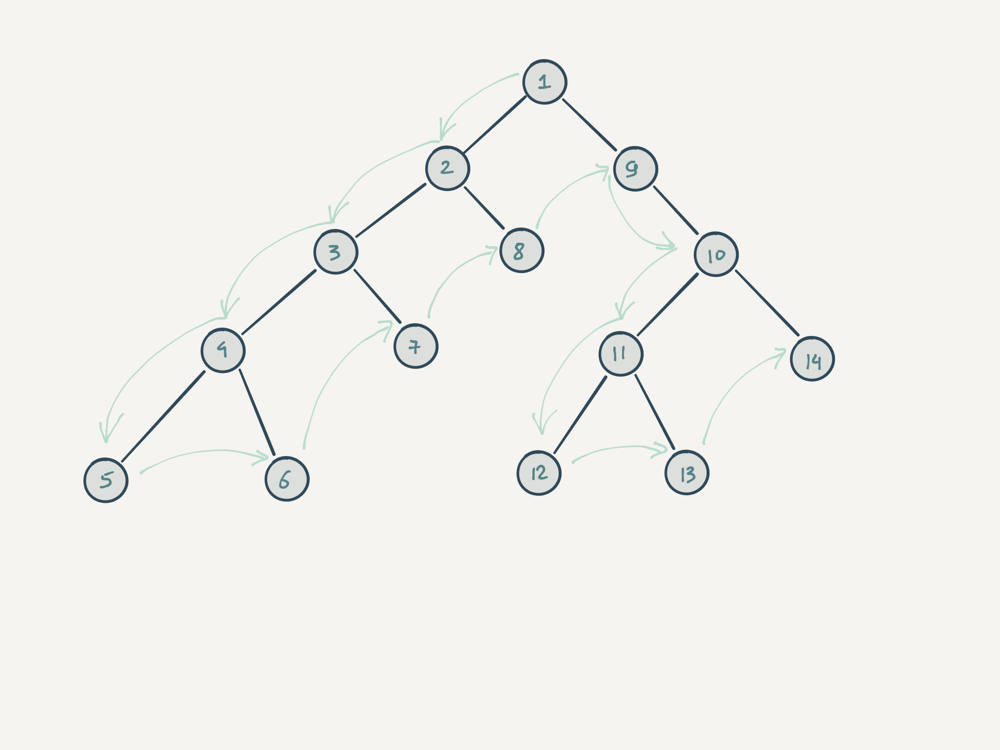

ГЛАВА: JS: ДЕРЕВЬЯ ======================================================================

ТЕОРИЯ: ВВЕДЕНИЕ ==============================================

Дерево — одна из самых распространённых структур данных в информатике и естественный способ моделирования некоторых предметных областей. С деревьями (как структурой данных) встречаются так или иначе все люди, даже те, кто далёк не только от программирования, но и от компьютеров в целом. Самым очевидным примером служит генеалогическое древо, а из более специализированного — файловое дерево. HTML (как и JSON, XML и многие другие) также имеет древовидную структуру. Комментарии и каталоги продуктов на сайтах тоже бывают древовидными. Любая иерархия является деревом по определению.

С деревьями связан один очень интересный аспект. Уровень понимания темы деревьев и способность с ними работать невероятно сильно коррелирует с уровнем разработчика. Если разработчику легко работать с деревьями, то, как правило, он довольно хорошо разбирается в коде, в том числе чужом, если нет, то и, в целом, у него больше сложностей с написанием и анализом кода.

В этом курсе нет нового синтаксиса и каких-то элементов программирования, которые не изучались на Хекслете до этого курса. Однако тема деревьев сложнее остальных тем из-за рекурсивной природы самих деревьев. Нужно "повернуть" мозги в правильную сторону и это, пожалуй, самая тяжёлая часть, которую невозможно "прокачать", читая теорию. В этом поможет только практика и эксперименты.

Для упрощения процесса понимания и запоминания рекомендации такие же как и раньше:

- Обязательно повторяйте весь код, который даётся в теории, локально на своём компьютере.
- Используйте отладочную печать настолько, насколько можно. Выводите на экран все изменения данных во время работы кода.
- Повторите уроки из курса «JS: Функции» про рекурсию.

В этом небольшом курсе мы слегка погрузимся в тему деревьев и научимся с ними работать. Чего не будет в этом курсе, так это алгоритмов в том виде, в котором эта тема подаётся в университете. У данного курса совсем другие цели. Он учит работать с рекурсивными структурами данных через древовидную рекурсию.

ТЕОРИЯ: ОПРЕДЕЛЕНИЯ ================================================

Файловая структура – пример дерева, с которым знакомы все, кто пользуется компьютером. Она состоит из директорий и разного вида файлов.

```bash
nodejs-package # корневая директория
├── Makefile # файл
├── README.md # файл
├── __tests__ # директория
│   └── half.test.js # файл
├── babel.config.js # файл
└── node_modules # директория
   └── @babel # директория
       └── cli # директория
           └── LICENSE # файл
```

Деревом она называется из-за своей структуры. Все элементы файловой системы выстраиваются в иерархию. В ней на верхнем уровне находится корневая директория (или диск, если речь идёт про Windows), а далее — файлы и директории, которые сами по себе могут содержать файлы и директории.

Ключевая черта древовидной структуры в том, что она рекурсивна. Другими словами, дерево состоит из поддеревьев состоящих в свою очередь из поддеревьев, которые состоят из поддеревьев... Эта особенность определяет основные способы работы с деревьями в коде, все они, так или иначе, работают рекурсивно.

Дерево состоит из узлов (вершин или нод, так как по-английски узел — это node) и рёбер между ними. Рёбра в реальности не существуют, они нужны лишь для того, чтобы визуализировать связь и, по необходимости, описать её. Узлы делятся на два типа: внутренние (те, у которых есть потомки) и листовые узлы (те, у которых нет потомков). В случае файловой системы листовые узлы представлены файлами, а внутренние — директориями.

У каждой вершины в дереве есть родитель (или предок). Единственным исключением является корневой узел — у него нет родителей, и именно с него начинается дерево. Количество потомков у любой внутренней вершины, в общем случае, может быть любым. Кроме того, в деревьях выделяют понятие глубины (depth), определяющей то, сколько шагов нужно пройти по вершинам от корневой, чтобы достичь текущей (той, на которую смотрим). Вершины, находящиеся на одной глубине и имеющие общего родителя, называют братскими или сестринскими.

РЕАЛИЗАЦИЯ

Количество способов, которыми можно описать деревья, бесконечно. Самый примитивный вариант — это вложенные массивы:

```bash
[['index.html', 'main.js'], 'index.js', ['favicon.ico', 'app.css']];
//                    * корень – сам массив
//         /          |         \
//       *         index.js       *
//  /         |               |        \
// index.html main.js   favicon.ico app.css

// Ещё пара примеров деревьев с произвольными данными:
[]; // пустое дерево
[3, 2, [3, 8], [[8], 3]];
[1, null, [[3]], [5, 'string', [undefined, [3], { key: 'value' }]]]
```

В примерах выше корень — это сам массив, а все его элементы — это дети. Если ребёнок не является массивом, то он рассматривается как листовой узел, иначе — как внутренний узел. Внутренний узел, в свою очередь, состоит из детей.

Любое дерево состоит из двух больших частей:

1. Данных, которые хранятся внутри дерева
2. Структуры дерева, которая отвечает за связи между данными

```bash
[['index.html', 'main.js'], 'index.js', ['favicon.ico', 'app.css']]
```

Что в этом дереве структура, а что данные? Данные здесь – листовые узлы, а вот внутренние массивы – исключительно структура. Они определяют, где какие данные (в данном случае файлы) находятся, но сами не содержат никаких данных. Подобная организация дерева непригодна для хранения файловой структуры. Как минимум это дерево не позволяет задать имя для директории.

Расширим структуру так, чтобы она позволяла добавлять больше информации. Представим каждый элемент дерева массивом, в котором первый элемент — это значение, хранящееся в узле, а второй элемент — массив детей. Если второй элемент отсутствует, то считаем, что текущий узел — листовой.

```bash
['app', [ // Корень
  ['dist', [ // Внутренний узел
    ['index.html'], // Лист
    ['main.js'], // Лист
  ]],
  ['index.js'], // Лист
  ['assets', [ // Внутренний узел
    ['favicon.ico'], // Лист
    ['app.css'], // Лист
  ]],
]]

//                   app
//         /          |         \
//       dist      index.js   assets
//  /         |               |        \
// index.html main.js   favicon.ico app.css
```

Такой вариант многословнее, но позволяет хранить данные в любом узле, даже не листовом. Причём это не обязательно должна быть строка как в примере выше. Изменение данных на объекты позволит добавлять туда все что угодно.

И самый гибкий и удобный способ представления деревьев — это объекты. В таком дереве каждый узел это объект, а массивы используются только для хранения списка детей.

```js
// Обратите внимание на разделение структуры и данных
// Здесь оно значительно более очевидное
{
  value: 5,
  children: [
    { value: 10 },
    { value: 100 },
    { value: 'nested', children: [/* ... */] }
  ]
}
```

По большому счёту, что массив, что объект сами по себе всегда могут рассматриваться как деревья. Это справедливо для любой рекурсивной структуры данных, то есть для такой структуры, элементами которой может быть сама структура. В любом массиве может содержаться массив, как и в любом объекте может содержаться объект.

Испытание-1: ОПРЕДЕЛЕНИЯ ==============================================

В этом задании под деревом понимается любой массив элементов, которые в свою очередь могут быть также деревьями (массивами). Пример:

```bash
[
  3, // лист
  [5, 3], // узел
  [[2]] // узел
]
```

Реализуйте и экспортируйте по умолчанию функцию, которая принимает на вход дерево, и возвращает новое, элементами которого являются дети вложенных узлов (см. пример).

Примеры

```js
import removeFirstLevel from '../removeFirstLevel.js'

// Второй уровень тут: 5, 3, 4
const tree1 = [[5], 1, [3, 4]]
removeFirstLevel(tree1) // [5, 3, 4]

const tree2 = [1, 2, [3, 5], [[4, 3], 2]]
removeFirstLevel(tree2)
// [3, 5, [4, 3], 2]
```

Подсказки
flat() - возвращает новый массив, в котором все элементы вложенных подмассивов были рекурсивно "подняты" на указанный уровень. Метод вызывается на массиве, который нужно обработать, например [[1], 2].flat();
Array.isArray() - проверяет, является ли элемент массивом.

<details>
  <summary>Посмотреть решение</summary>

```js
// teacher solution
const removeFirstLevel = (tree) => {
  const nodes = tree.filter(Array.isArray)
  return nodes.flat()
}

export default removeFirstLevel
```

</details>

ТЕОРИЯ: ВИРТУАЛЬНАЯ ФАЙЛОВАЯ СИСТЕМА ================================================

В этом курсе мы создадим виртуальную (не настоящую) файловую систему и реализуем повседневные операции для работы с ней: подсчет свободного места, поиск файлов и директорий и другие. Эта файловая система не имеет практического применения, на ней мы будем обкатывать навыки работы с древовидными структурами данных. Обработка любых деревьев в сущности не отличается. Файловая система, каталоги товаров, адреса, родственные связи и многое другое — все эти данные можно представить в виде дерева. Подход в работе с каждым типом будет один и тот же. Научившись работать с одним деревом, вы сможете применять эти же знания в работе с другими деревьями.

Вот как выглядит создание дерева виртуальной файловой системы:

```js
import * as fsTrees from '@hexlet/immutable-fs-trees'

// mkdir вторым параметром принимает список детей,
// которые могут быть либо директориями, созданными mkdir,
// либо файлами, созданными mkfile
const tree = fsTrees.mkdir('etc', [
  fsTrees.mkfile('bashrc'),
  fsTrees.mkdir('consul', [fsTrees.mkfile('config.json')]),
])
```

Первым параметром в функции mkdir() и mkfile() передается имя создаваемой директории или файла. Вторым параметром функция mkdir() принимает список вложенных в нее файлов и директорий. Последним параметром обе функции принимают метаданные meta, о которых мы поговорим чуть позже.

В результате получается такая структура:

```bash
etc
├── bashrc
└── consul
    └── config.json
```

Вкладывая вызовы mkdir и mkfile в другие mkdir, можно получить любую файловую структуру. Корнем в этой структуре будет директория, а в листьях могут оказаться как файлы, так и пустые директории.

Эта структура виртуальная, то есть реального создания файлов и директорий не происходит. Вся информация о файловой системе находится в переменной tree. Если ее распечатать на экран, то мы увидим следующее содержимое:

```js
{
  name: 'etc',
  type: 'directory',
  meta: {},
  children: [
    {
      name: 'bashrc',
      type: 'file',
      meta: {},
    },
    {
      name: 'consul',
      type: 'directory',
      meta: {},
      children: [
        {
          name: 'config.json',
          type: 'file',
          meta: {},
        }
      ],
    },
  ],
};
```

Это внутренняя реализация файлового дерева. Она состоит из двух типов узлов: директорий и файлов.

Представление директории:

```js
{
  name: /* ... */,
  type: 'directory',
  meta: {}, // Свойства директории
  children: [/* ... */], // Здесь хранятся дети
}
```

Представление файла:

```js
{
  name: /* ... */,
  type: 'file',
  meta: {}, // Свойства файла
}
```

У файлов и директорий есть имена, это общая часть. Свойство type определяет тип узла и с его помощью можно понять, что перед нами во время обработки этого дерева. meta — объект с произвольными данными, например, размером, датой создания и так далее. Свойства задаются во время создания узлов:

```js
fsTrees.mkfile('.bashrc', { size: 75 })
fsTrees.mkdir(
  'hexlet',
  [
    /* дети */
  ],
  { owner: 'nobody' },
)
```

Метаданные понадобятся функциям, которые анализируют дерево, например считают занятое место.

Испытание-2: ВИРТУАЛЬНАЯ ФАЙЛОВАЯ СИСТЕМА

Реализуйте и экспортируйте по умолчанию функцию, которая создает и возвращает такую файловую систему (порядок элементов важен):

```bash
# Обратите внимание на метаданные

nodejs-package # директория (метаданные: { hidden: true })
├── Makefile # файл
├── README.md # файл
├── dist # пустая директория
├── __tests__ # директория
│   └── half.test.js # файл (метаданные: { type: 'text/javascript' })
├── babel.config.js # файл (метаданные: { type: 'text/javascript' })
└── node_modules # директория (метаданные: { owner: 'root', hidden: false })
    └── @babel # директория
        └── cli # директория
            └── LICENSE # файл
```

<details>
  <summary>Посмотреть решение</summary>

```js
// my solution
import { mkfile, mkdir } from '@hexlet/immutable-fs-trees'

const generate = () => {
  const tree = mkdir(
    'nodejs-package',
    [
      mkfile('Makefile'),
      mkfile('README.md'),
      mkdir('dist', []),
      mkdir('__tests__', [mkfile('half.test.js', { type: 'text/javascript' })]),
      mkfile('babel.config.js', { type: 'text/javascript' }),
      mkdir(
        'node_modules',
        [mkdir('@babel', [mkdir('cli', [mkfile('LICENSE')])])],
        { owner: 'root', hidden: false },
      ),
    ],
    { hidden: true },
  )

  return tree
}

export default generate
```

</details>

ТЕОРИЯ: МАНИПУЛЯЦИИ С ВИРТУАЛЬНОЙ ФАЙЛОВОЙ СИСТЕМОЙ ======================================

Библиотека, которая используется для построения деревьев, рассчитана только на неизменяемые файловые структуры. То есть уже после создания её поменять нельзя. Но можно на основе старой структуры сделать новую, в которой какие-то части будут изменены.

Неизменяемая структура выбрана для этого курса неслучайно. Такую структуру легче отлаживать и меньше шансов допустить ошибки. И она позволяет максимально погрузиться в использование функций высшего порядка.

Пакет @hexlet/immutable-fs-trees позволяет не только создавать, но и извлекать данные из уже созданных файлов и директорий с помощью базовых операций. Они позволяют не лезть во внутреннюю структуру самого дерева:

```js
import * as fsTrees from '@hexlet/immutable-fs-trees'

const tree = fsTrees.mkdir('/', [fsTrees.mkfile('hexlet.log')], {
  hidden: true,
})
fsTrees.getName(tree) // '/'
fsTrees.getMeta(tree).hidden // true

const [file] = fsTrees.getChildren(tree)
fsTrees.getName(file) // 'hexlet.log'

// У файла нет метаданных
fsTrees.getMeta(file).unknown // undefined

// А вот так делать не надо
// У файлов нет детей
fsTrees.getChildren(file)
```

Дополнительно в пакете есть две функции для проверки типа. С их помощью можно выборочно работать с файлами и директориями:

```js
import * as fsTrees from '@hexlet/immutable-fs-trees'

const tree = fsTrees.mkdir('/', [fsTrees.mkfile('hexlet.log')], {
  hidden: true,
})
fsTrees.isDirectory(tree) // true
fsTrees.isFile(tree) // false

const [file] = fsTrees.getChildren(tree)
fsTrees.isFile(file) // true
fsTrees.isDirectory(file) // false
```

Рассмотренных операций хватит для выполнения любых преобразований над файлами и директориями. Начнём с самых простых, которые не требуют рекурсивного обхода.

ОБРАБОТКА -------------------------------------------

Любая обработка в неизменяемом стиле сводится к формированию новых данных на основе старых. Ниже мы реализуем некоторые варианты преобразования, раскрывающие эту идею.

Изменение имени файла

```js
const file = fsTrees.mkfile('one', { size: 35 })

// При переименовании важно сохранить метаданные
// _ – lodash
const newMeta = _.cloneDeep(fsTrees.getMeta(file))
const newFile = fsTrees.mkfile('new name', newMeta)
```

Фактически здесь создается новый файл с метаданными старого. Перед тем как создать новый файл, метаданные клонируются (глубоким клонированием). Почему? Объекты передаются по ссылке, и если не выполнить клонирование, то в метаданных нового файла окажутся метаданные старого. Как только мы захотим изменить что-то, то изменив новое — сломаем старое:

```js
const file = fsTrees.mkfile('one', { size: 35 })

// При переименовании важно сохранить метаданные
const newMeta = fsTrees.getMeta(file)
// Бум! У file тоже поменялись метаданные
newMeta.size = 15
const newFile = fsTrees.mkfile('new name', newMeta)

console.log(fsTrees.getMeta(file)) // { size: 15 }
```

Сортировка содержимого директории

```js
// Сортировка в обратном порядке

const tree = fsTrees.mkdir('/', [
  fsTrees.mkfile('one'),
  fsTrees.mkfile('two'),
  fsTrees.mkdir('three'),
])

const children = fsTrees.getChildren(tree)
const newMeta = _.cloneDeep(fsTrees.getMeta(tree))
// reverse изменяет массив, поэтому клонируем
const newChildren = [...children].reverse()
const tree2 = fsTrees.mkdir(fsTrees.getName(tree), newChildren, newMeta)
console.log(tree2)
// => {
// =>   name: '/',
// =>   children: [
// =>     { name: 'three', children: [], meta: {}, type: 'directory' },
// =>     { name: 'two', meta: {}, type: 'file' },
// =>     { name: 'one', meta: {}, type: 'file' }
// =>   ],
// =>   meta: {},
// =>   type: 'directory'
// => }
```

Обновление содержимого директории

```js
// Приведение к нижнему регистру имён директорий и файлов
// внутри конкретной директории

const tree = fsTrees.mkdir('/', [
  fsTrees.mkfile('oNe'),
  fsTrees.mkfile('Two'),
  fsTrees.mkdir('THREE'),
])

const children = fsTrees.getChildren(tree)
const newChildren = children.map((child) => {
  const name = fsTrees.getName(child)
  const newMeta = _.cloneDeep(fsTrees.getMeta(child))
  if (fsTrees.isDirectory(child)) {
    const children = [...fsTrees.getChildren(child)]
    return fsTrees.mkdir(name.toLowerCase(), children, newMeta)
  }
  return fsTrees.mkfile(name.toLowerCase(), newMeta)
})
// Обязательно копируем метаданные
const newMeta = _.cloneDeep(fsTrees.getMeta(tree))
const tree2 = fsTrees.mkdir(fsTrees.getName(tree), newChildren, newMeta)
console.log(tree2)
// => {
// =>   name: '/',
// =>   children: [
// =>     { name: 'one', meta: {}, type: 'file' },
// =>     { name: 'two', meta: {}, type: 'file' },
// =>     { name: 'three', children: [], meta: {}, type: 'directory' }
// =>   ],
// =>   meta: {},
// =>   type: 'directory'
// => }
```

Удаление файлов внутри директории

```js
const tree = fsTrees.mkdir('/', [
  fsTrees.mkfile('one'),
  fsTrees.mkfile('two'),
  fsTrees.mkdir('three'),
])

const children = fsTrees.getChildren(tree)
const newChildren = children.filter(fsTrees.isDirectory)
const newMeta = _.cloneDeep(fsTrees.getMeta(tree))
const tree2 = fsTrees.mkdir(fsTrees.getName(tree), newChildren, newMeta)
console.log(tree2)
// => {
// =>   name: '/',
// =>   children: [ { name: 'three', children: [], meta: {}, type: 'directory' } ],
// =>   meta: {},
// =>   type: 'directory'
// => }
```

Испытание-3: МАНИПУЛЯЦИИ С ВИРТУАЛЬНОЙ ФАЙЛОВОЙ СИСТЕМОЙ
Реализуйте и экспортируйте функцию compressImages(), которая принимает на вход директорию, находит внутри нее картинки и "сжимает" их. Под сжиманием понимается уменьшение свойства size в метаданных в два раза. Функция должна вернуть новую директорию со сжатыми картинками и всеми остальными данными, которые были внутри этой директории. Проверять вложенные директории не нужно, то есть функция должна находить только те картинки, которые лежат в текущей, но не во внутренних директориях.

Картинками считаются все файлы заканчивающиеся на .jpg.

Примеры

```js
const tree = fsTrees.mkdir('my documents', [
  fsTrees.mkfile('avatar.jpg', { size: 100 }),
  fsTrees.mkfile('passport.jpg', { size: 200 }),
  fsTrees.mkfile('family.jpg', { size: 150 }),
  fsTrees.mkfile('addresses', { size: 125 }),
  fsTrees.mkdir('presentations'),
])

const newTree = compressImages(tree)
// То же самое, что и tree, но во всех картинках размер уменьшен в два раза
```

<details>
  <summary>Посмотреть решение</summary>

```js
// my solution
const compressImages = (tree) => {
  const children = fsTrees.getChildren(tree)
  const newChildren = children.map((child) => {
    const name = fsTrees.getName(child)
    if (fsTrees.isFile(child) && name.endsWith('.jpg')) {
      const meta = fsTrees.getMeta(child)
      // Клонируем старые метаданные и уменьшаем размер в 2 раза
      const newMeta = { ..._.cloneDeep(meta), size: meta.size / 2 }
      return fsTrees.mkfile(name, newMeta)
    }

    return child
  })
  const newMeta = _.cloneDeep(fsTrees.getMeta(tree))
  return fsTrees.mkdir(fsTrees.getName(tree), newChildren, newMeta)
}

// teacher solution
const compressImages = (node) => {
  const children = fsTrees.getChildren(node)
  const newChildren = children.map((child) => {
    const name = fsTrees.getName(child)
    if (!fsTrees.isFile(child) || !name.endsWith('.jpg')) {
      return child
    }
    const meta = fsTrees.getMeta(child)
    const newMeta = cloneDeep(meta)
    newMeta.size /= 2

    return fsTrees.mkfile(name, newMeta)
  })

  const newMeta = cloneDeep(fsTrees.getMeta(node))
  return fsTrees.mkdir(fsTrees.getName(node), newChildren, newMeta)
}
```

</details>

ТЕОРИЯ: ОБХОД ДЕРЕВА ================================================

Пошаговый перебор элементов дерева по связям между узлами-предками и узлами-потомками называется обходом дерева. Подразумевается, что в процессе обхода каждый узел будет затронут только один раз. По большому счёту, всё так же, как и в обходе любой коллекции, используя цикл или рекурсию. Только в случае деревьев способов обхода больше, чем просто слева направо и справа налево.

В данном курсе используется один порядок обхода — обход в глубину, так как он естественным образом получается при рекурсивном обходе. Об остальных способах можно прочитать в Википедии либо в рекомендуемых Хекслетом книгах.

ОБХОД В ГЛУБИНУ (depth-first search) ----------------------------------

Один из методов обхода дерева (графа в общем случае). Стратегия этого поиска состоит в том, чтобы идти вглубь одного поддерева настолько, насколько это возможно. Этот алгоритм естественным образом ложится на рекурсивное решение и получается сам собой.


